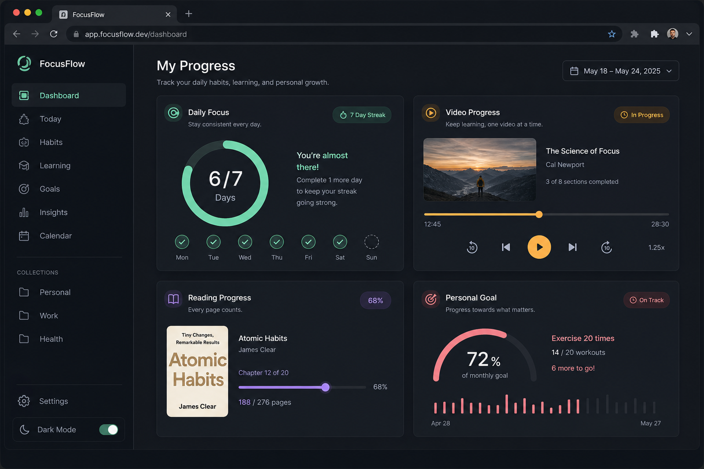
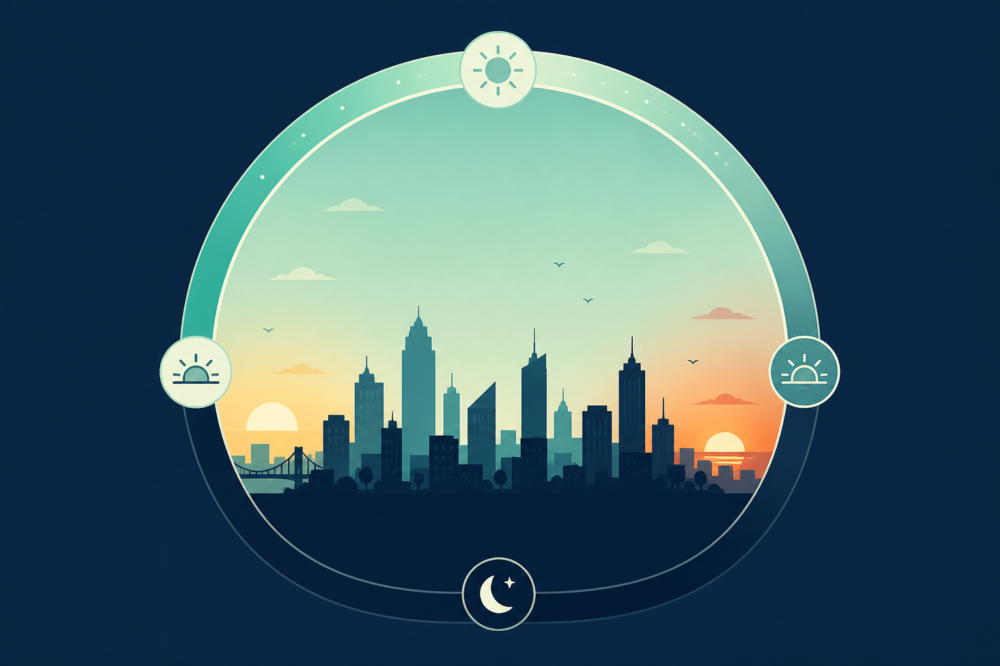
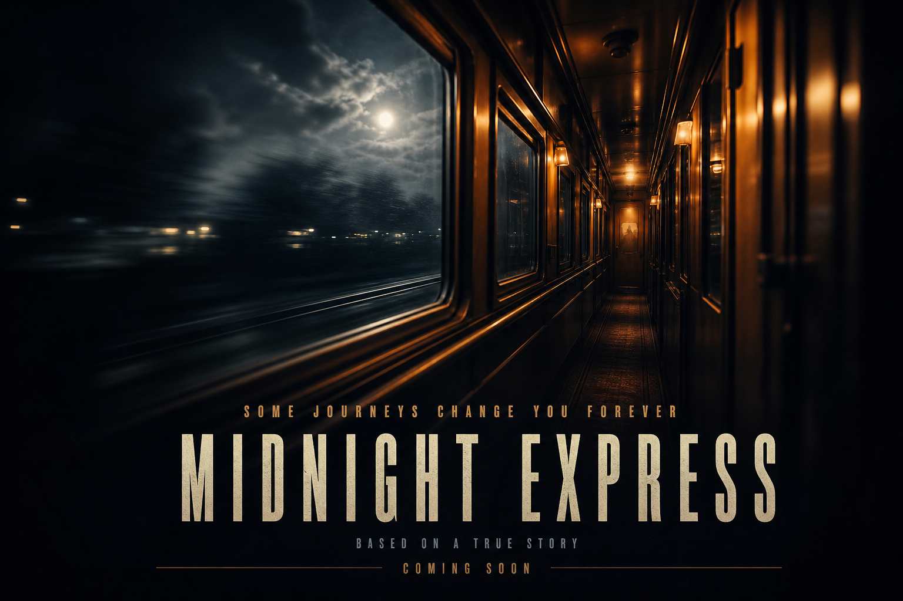

# Progress Hub

**Challenge #086 · Prompt: Progress**

**Live demo:** https://abhijeetsinghdevgan.github.io/challenge-086-prompt-progress/

An interactive single-page demo that explores what “progress” means in different contexts. Time, media, reading, and personal goals all move forward — but each is measured differently.



## Preview

| Asset | Used for |
|-------|----------|
| [Hero banner](assets/hero-banner.png) | Top of page — abstract motion arcs |
| [Day visual](assets/day-visual.png) | Today widget — sunrise-to-night cycle |
| [Movie poster](assets/movie-poster.png) | Film widget — playback card artwork |
| [Book cover](assets/book-cover.png) | Book widget — reading progress |
| [Goal visual](assets/goal-visual.png) | Personal goal widget — milestone illustration |
| [Dashboard shot](assets/screenshot-dashboard.png) | Full UI overview (README & social preview) |

### Widget gallery

<p align="center">
  
  
  
  
</p>

## What it does

Progress Hub bundles four independent trackers on one dashboard:

| Widget | What advances | How it works |
|--------|----------------|--------------|
| **Today** | The current calendar day | Compares elapsed time since midnight to a 24-hour day. Shows a ring chart, percentage complete, time elapsed, and time until midnight. Updates every 30 seconds. |
| **Film** | Movie playback | Scrub through a 2h 04m runtime. See current position, time remaining, and percent watched. Press **Play** to simulate playback (ticks every second). |
| **Book** | Pages read | Drag the slider across 304 pages. Visual page stack, progress bar, chapter label (from page milestones), and an ETA based on 28 pages per day. |
| **Your goal** | A personal milestone | Name your goal and set completion from 0–100%. Milestone markers at 25% intervals. Progress is saved in `localStorage` so it persists across visits. |

The idea behind the project: **progress is not one number**. A film counts seconds, a book counts pages, a day counts light, and a goal counts intention.

## Quick start

No build step or dependencies required.

1. Clone the repository:
   ```bash
   git clone https://github.com/abhijeetsinghdevgan/challenge-086-prompt-progress.git
   cd challenge-086-prompt-progress
   ```
2. Open `index.html` in any modern browser (double-click the file, or use a local server).

That’s it — vanilla HTML, CSS, and JavaScript only.

### Optional: local server

If you prefer serving files over `file://`:

```bash
# Python 3
python -m http.server 8080

# Node (npx)
npx serve .
```

Then visit `http://localhost:8080`.

## Project structure

```
├── index.html
├── styles.css
├── app.js
├── README.md
└── assets/
    ├── hero-banner.png
    ├── screenshot-dashboard.png
    ├── day-visual.png
    ├── movie-poster.png
    ├── book-cover.png
    ├── goal-visual.png
    └── icons/
        ├── icon-day.svg
        ├── icon-film.svg
        ├── icon-book.svg
        └── icon-goal.svg
```

## Tech stack

- **HTML5** — semantic sections, accessible labels and ARIA where helpful
- **CSS** — custom properties, grid layout, SVG stroke animation, responsive design
- **JavaScript** — no frameworks; `localStorage` for the personal goal widget
- **Assets** — PNG illustrations for cards and hero; SVG icons per widget

External fonts (Google Fonts): DM Sans, JetBrains Mono.

## Browser support

Works in current versions of Chrome, Firefox, Safari, and Edge. Uses standard APIs: `Date`, `localStorage`, range inputs, and CSS custom properties.

## License

This project was created as a creative coding challenge demo. Feel free to fork, learn from, or adapt it for your own experiments.
